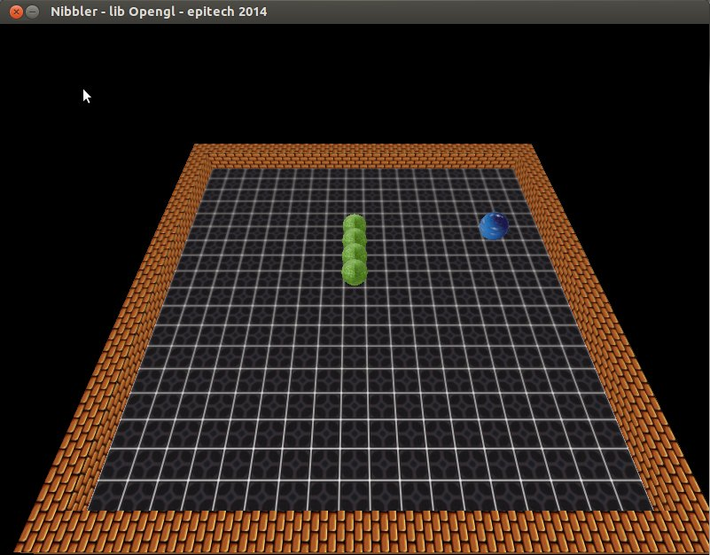
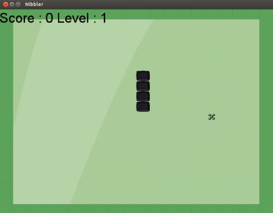
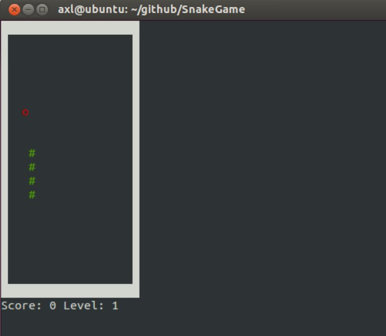

SnakeGame
=========

SnakeGame is developped in C++ and let you choose which graphic library you want to use while executing the game :)

Usage
========

nibbler x y ./lib.so

where x and y must be between 20 and 60.

Libraries
========

The Dynamic libraries availables are Opengl SFML and ncurses. You can choose one of them and even
if you like, code your view with another graphic library.

Example of use
========

./nibbler 20 20 ./lib_nibbler_opengl.so

or

./nibbler 40 20 ./lib_nibbler_SFML.so

GamePlay:
========

Key UP DOWN RIGHT LEFT

Dependencies
========

SDL* OPENGL SFML NCURSES libraries.

HF

Axel Catusse